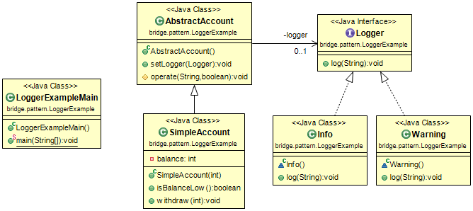

## Also known as

Handle/Body

## Intent

Decouple an abstraction from its implementation so that the two can vary independently.

## Explanation

Real world example

> Consider you have a weapon with different enchantments, and you are supposed to allow mixing 
> different weapons with different enchantments. What would you do? Create multiple copies of each 
> of the weapons for each of the enchantments or would you just create separate enchantment and set 
> it for the weapon as needed? Bridge pattern allows you to do the second.

In Plain Words

> Bridge pattern is about preferring composition over inheritance. Implementation details are pushed 
> from a hierarchy to another object with a separate hierarchy.

Wikipedia says

> The bridge pattern is a design pattern used in software engineering that is meant to "decouple an abstraction from its implementation so that the two can vary independently"

**Programmatic Example**

Translating our weapon example from above. Here we have the `Weapon` hierarchy:

## Class diagram


## Applicability

Use the Bridge pattern when

* You want to avoid a permanent binding between an abstraction and its implementation. This might be the case, for example, when the implementation must be selected or switched at run-time.
* Both the abstractions and their implementations should be extensible by subclassing. In this case, the Bridge pattern lets you combine the different abstractions and implementations and extend them independently.
* Changes in the implementation of an abstraction should have no impact on clients; that is, their code should not have to be recompiled.
* You have a proliferation of classes. Such a class hierarchy indicates the need for splitting an object into two parts. Rumbaugh uses the term "nested generalizations" to refer to such class hierarchies.
* You want to share an implementation among multiple objects (perhaps using reference counting), and this fact should be hidden from the client. A simple example is Coplien's String class, in which multiple objects can share the same string representation.

```java
interface Logger {
  void log(String message);
}

class Info implements Logger {

  @Override
  public void log(String message) {
    System.out.println("info: " + message);
  }
}

class Warning implements Logger {

  @Override
  public void log(String message) {
    System.out.println("warning: " + message);
  }
}
```

Here's the separate Acount hierarchy:

```java
public class AbstractAccount {
 private Logger logger = new Info();

 public void setLogger(Logger logger) {
   this.logger = logger;
 }

  // the logging part is delegated to the Logger implementation
  protected void operate(String message, boolean result) {
   logger.log(message + " result " + result);
  }
}
```

Here are both hierarchies in action:

```java
public class App {
  public static void main(String[] args) {
    SimpleAccount account = new SimpleAccount(100);
    account.withdraw(75);

    if (account.isBalanceLow()) {
      // you can also change the Logger implementation at runtime
      account.setLogger(new Warning());
    }

    account.withdraw(10);
    account.withdraw(100);
  }
}
```

## Tutorial

* [Bridge Pattern Tutorial](https://www.journaldev.com/1491/bridge-design-pattern-java)

## Credits

* [Design Patterns: Elements of Reusable Object-Oriented Software](https://www.amazon.com/gp/product/0201633612/ref=as_li_tl?ie=UTF8&camp=1789&creative=9325&creativeASIN=0201633612&linkCode=as2&tag=javadesignpat-20&linkId=675d49790ce11db99d90bde47f1aeb59)
* [Head First Design Patterns: A Brain-Friendly Guide](https://www.amazon.com/gp/product/0596007124/ref=as_li_tl?ie=UTF8&camp=1789&creative=9325&creativeASIN=0596007124&linkCode=as2&tag=javadesignpat-20&linkId=6b8b6eea86021af6c8e3cd3fc382cb5b)
